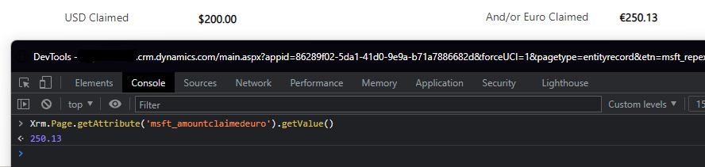

# Euro Currency Field - PCF Code Component

## About

This control is a React JS PCF Code Component for model-driven applications.  Model-driven applications do not allow mixed currency symbols on a form by default.  While the underlining hidden control is dollars, the visual (this PCF control) shows the Euro Symbol.  You must calculate the exchange rate on your own if you want to convert it to another currency.  This control is just for a visual representation only. The value is saved in the hidden underlining currency field as shown in the picture below.  It allows a user to type in more than two fixed decimal places, but will automatically round the value using the same behavior as the default currency control has.  The control uses [Fluent UI](https://developer.microsoft.com/en-us/fluentui#/) and custom styles to match the style of a model-driven application currency field.

This project was generated with [Power Apps component framework](https://docs.microsoft.com/en-us/powerapps/developer/component-framework/get-powerapps-cli).

## Build

Run `npm run build` to build the project. 

## Run

Run `npm run start` to run the project.

## Update Control Manifest

Run `npm run refreshTypes` to refresh the types.

## Lint Fix React JS

Run `npm run lint:fix` to lint and format JavaScript

## Further help

To get more help on the Power Apps component framework check out the [Power Apps component framework overview](https://docs.microsoft.com/en-us/powerapps/developer/component-framework/overview).
